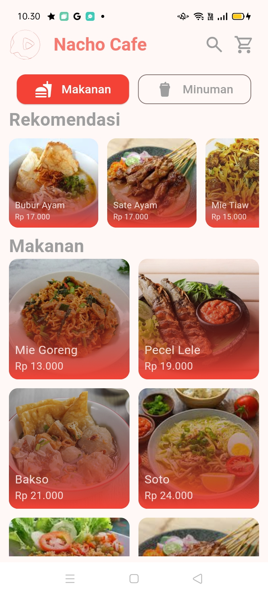
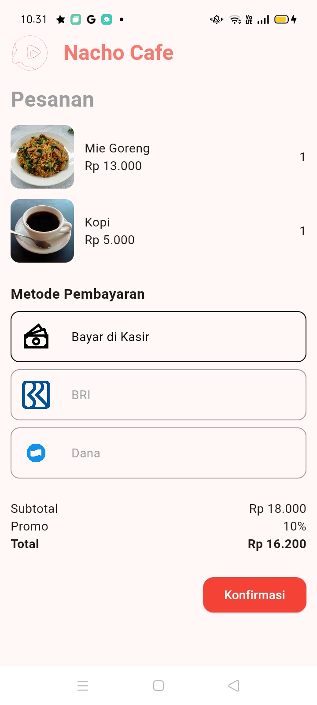

# Nacho Cafe

Read in: [Bahasa Indonesia](README_ID.md)

The purpose of this Rep1ository is to create a simple Food and Drink ordering app where users can browse, search, add to cart, and process payment. It uses the Provider package for state management.

Technologies: **Flutter**

Dependencies: **provider**, **flutter_svg**

## Screenshots

## Features

- List of available foods and drinks.
- Add food or drink to cart.
- Search foods and drinks.
- Place orders.

## Setup

To get started with this project, follow these steps:

- Clone the repository.
- Open terminal / command prompt.
- Navigate to the project repository.
- Run `flutter pub get` to install the dependencies.
